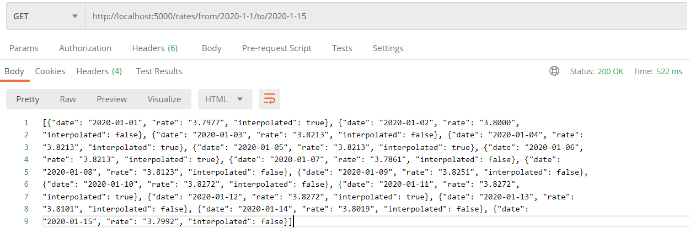
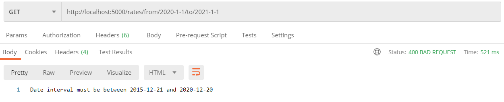
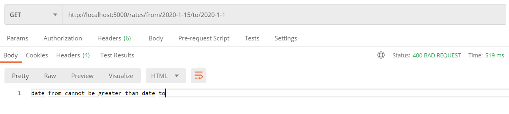
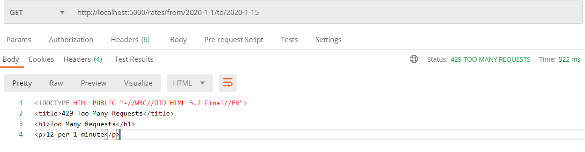
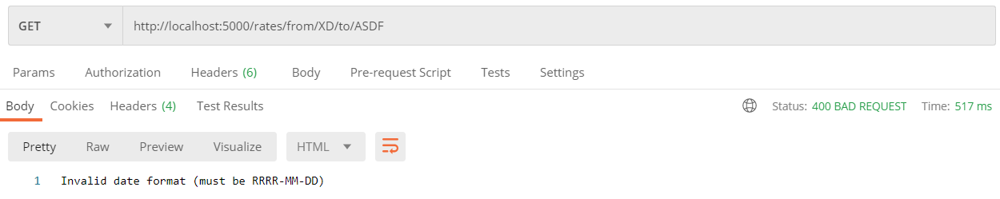
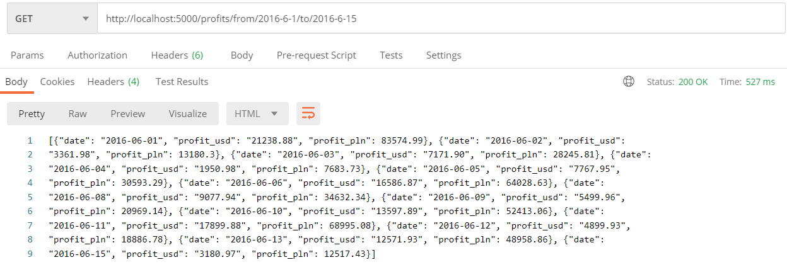

# Języki skryptowe lista 5

## Ogólne informacje
API utworzone według wymagań listy 5

## Instalacja paczek

### Komendy do wywołania:
*pip install flask  
pip install flask-limiter  
pip install pyodbc  
pip install requests*

### Na Windowsie najnowsza wersja numpy powodowała problemy
*pip uninstall numpy  
pip install numpy==1.19.3*

## Uruchomienie
Po zainstalowaniu paczek:  
Skonfigurować połączenie z bazą danych w pliku db_connection.py. Użyta baza: https://www.sqlservertutorial.net/sql-server-sample-database/  
W przypadku pierwszego uruchomienia, wywołać skrypt *db_connection.py*. Dodaje on tabelę rates i uzupełnia ją danymi startowymi.  
Windows - *python app.py*  
Linux, Mac - *python3 app.py*  
Serwer będzie dostępny pod adresem http://localhost:5000

## Endpointy

### Zadanie 1 i 2
### GET /rates/from/<date_from>/to/<date_to>
Gdzie <date_from> i <date_to> to daty w formacie RRRR-MM-DD  
Status 200: Zwraca listę rate_dto  
Status 400: Dla niepoprawnie sformatowanych dat  
Status 400: Jeśli pojawią się dni spoza zakresu  

Model rate_dto:  
date : datetime RRRR-MM-DD     --> Data dla której zwracany jest kurs  
rate : float                   --> Kurs PLN-USD  
interpolated : bool            --> Czy wartość została przeniesiona z poprzedniego dnia z powodu braku danych  

### Zadanie 3
### GET /profits/day/<summary_date>
Gdzie <summary_date> to data w formacie RRRR-MM-DD  
Status 200: Zwraca listę profit_dto  
Status 400: Dla niepoprawnie sformatowanych dat  
Status 400: Jeśli pojawią się dni spoza zakresu  
Dla dni, w których nie odnotowano żadnego zysku, nic nie zwraca  

Model profit_dto:  
date : datetime RRRR-MM-DD -->      Data dla której zwracane są wyniki  
profit_usd : float         -->  Dochód z danego dnia w USD  
profit_pln : float         -->  Dochód z danego dnia w PLN  

## Informacje techniczne
* Żeby serwer nie został zapchany, stosowane jest ograniczenie 12 zapytań na minutę dla każdego użytkownika. W przypadku przekroczenia tej wartości, zwracany jest status code 429.
* Zakres dat obsługiwany przez api: od 2015-12-21 do dzień wcześniej względem dnia poprzedniego
* Ze względu na małą ilość danych oraz ich niezmienność, wszystkie zwracane dane są przechowywane w cache. Cache jest odświeżane codziennie o 21 (app.py -> update_at_hour)
* Najnowsze kursy są pobierane codziennie o 21 (app.py -> update_at_hour). Taka godzina gwarantuje, że NBP uzupełni swoje dane na ten dzień i mechanizm odświeżający bazę danych nie wstawi wartości interpolated dla danego dnia 

## Screeny

### Poprawna odpowiedź od /rates -> 200

### Data wykracza spoza dozwolonego zakresu -> 400

### Data początkowa jest większa niż data końcowa -> 400

### Zabezpieczenie antyspamowe -> 429

### Niepoprawne daty ('XD', 'ASDF') -> 400

### Poprawna odpowiedź od /profits -> 200

