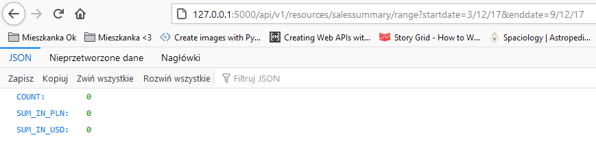

#Screenshoty ilustrujące przykłady z dokumentacji, potwierdzające działanie API.

##exchangerates

###exchangerates

###exchangerate?startdate=9/9/18

###exchangerate?enddate=9/9/18

###exchangerate?startdate=3/12/17&enddate=9/12/17

##salessummary

###salessummary?date=12/12/18

##salessummary/range

###salessummary/range

###salessummary/range?startdate=9/9/18

###salessummary/range?enddate=9/9/18

###salessummary/range?startdate=3/12/17&enddate=9/12/17
